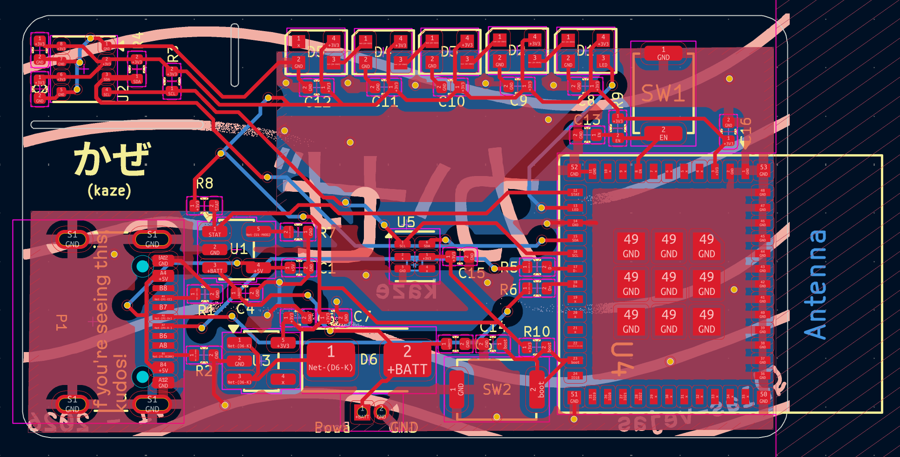
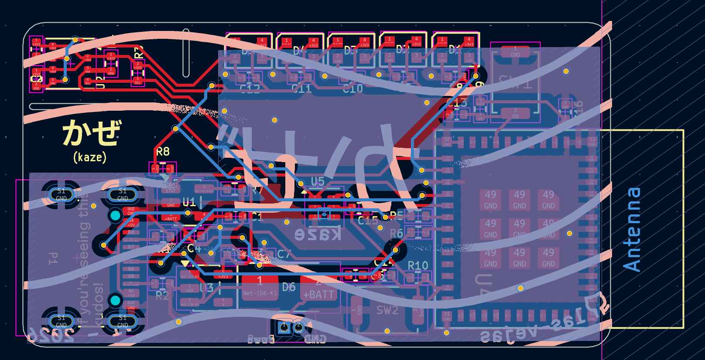
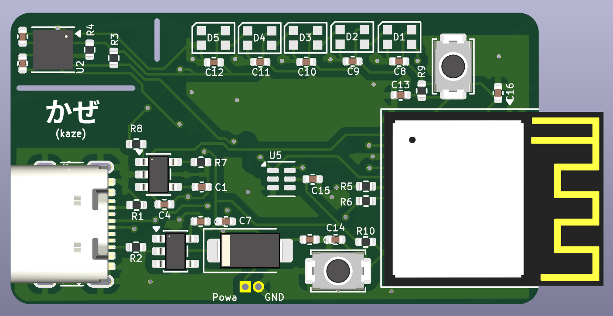
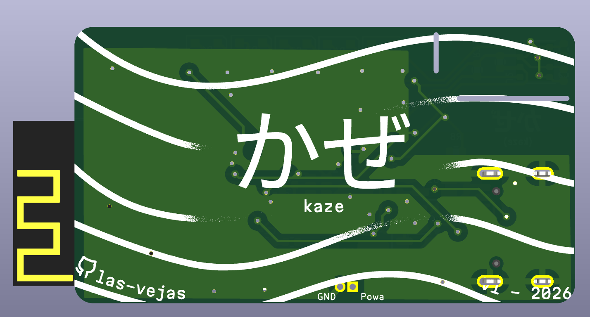

# かぜ (kaze)

A surrounding sensor that measures a bunch of things!
Heres a list of what it can measure:
 - Temperature (BME680)
 - Humidity (BME680)
 - Pressure (BME680)
 - CO2 (BME680) (therefore AQI too)
 - lux (TSL2561)
 - and a couple more...

It is powered by the ESP32-C6 module and supports IoT protocols like Zigbee, Wi-fi, Bluetooth and Thread.
The software (that I will eventually write) will be for ESPHome as its very easy to set up IoT and home devices that way with the help of Home Assistant.

The biggest cost for this project would be the BME680 sensor as it costs about 10$

## Images
  
  
  
  
